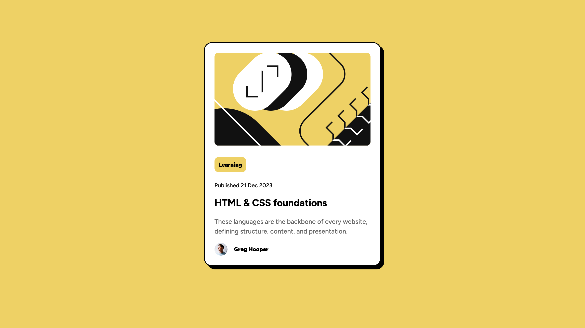

# Frontend Mentor - Blog preview card solution

This is a solution to the [Blog preview card challenge on Frontend Mentor](https://www.frontendmentor.io/challenges/blog-preview-card-ckPaj01IcS). Frontend Mentor challenges help you improve your coding skills by building realistic projects. 

## Table of contents

- [Overview](#overview)
  - [The challenge](#the-challenge)
  - [Screenshot](#screenshot)
  - [Links](#links)
- [My process](#my-process)
  - [Built with](#built-with)
  - [What I learned](#what-i-learned)
  - [Continued development](#continued-development)
  - [Useful resources](#useful-resources)
- [Author](#author)
- [Acknowledgments](#acknowledgments)

**Note: Delete this note and update the table of contents based on what sections you keep.**

## Overview

### The challenge

Users should be able to:

- See hover and focus states for all interactive elements on the page

### Screenshot

### Links

- Solution URL: https://github.com/C-likethis123/frontend_mentor/blog-preview-card-main
- Live Site URL: https://c-likethis123.github.io/frontend_mentor/blog-preview-card-main/index.html

## My process

### Built with

- Semantic HTML5 markup
- CSS
- Flexbox

### Continued development

I would like to focus more on:
- Organisation of CSS code: eg: a framework, responsive development

## Author

- Website - [Chow Jia Ying](https://www.c-likethis123.github.io/website)
- Frontend Mentor - [@yourusername](https://www.frontendmentor.io/profile/C-likethis123)
